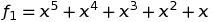
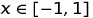
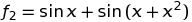
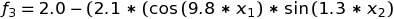
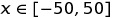
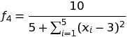
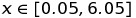

# Neuralnetwork-Actividad-1
Implementación de una red neuronal feedforward-Backpropagation para regresión.

Utilizando los conceptos y el material visto en clase realice lo siguiente:

  1. Implemente un red neuronal de alimentación hacia delante con algoritmo de retro-propagación del error (feedforward-Backpropagation Neuralnetwork).
  1. Por cada una de las function de la Tabla 1 realice:
     * Grafíque el comportamiento de la función dentro de los límites dados.
     * Genere aleatoriamente un conjunto de entrenamiento y un cojunto de prueba.
     * Entrene la red neuronal para ajustar a los datos de la función.
     * Grafíque el comportamiento real vs el ajuste de la red neuronal.
     * Grafíque el comportamiento de la red neuronal para descartar el sobre-entrenamiento (entrenamiento vs prueba).
     * Genere un nuevo conjunto y asegure que los datos son 100% nuevos, es decir, que no existan en los conjuntos de entrenamiento y prueba. Muestre el comportamiento de la red con el nuevo conjunto y muestre su error.

### Tabla 1. Funciones de prueba.

| Función   | límites |
| -----------| -------|
|  |   |
|  |   |
|  |  | 
|  |  | 
